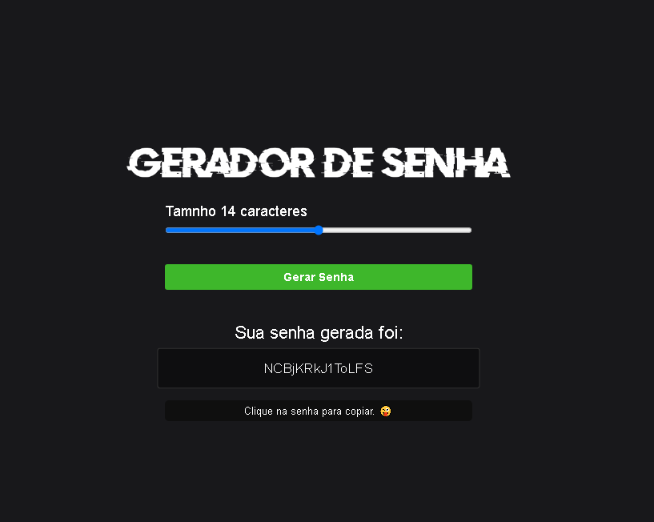

# Password Generator

---

Projeto gerador de senha onde o usuário escolhe a quantidade de caracteres que queira na sua senha e gera. Ao clicar em cima da senha gerada, o programa já copia automaticamente a senha para sua área de transferência.

Desenvolvido com:

- HTML
- CSS
- JavaScript